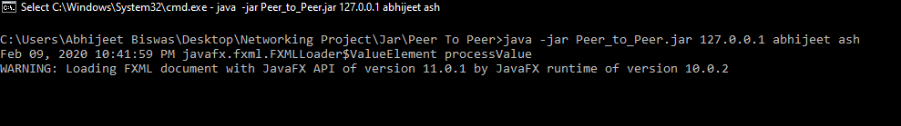
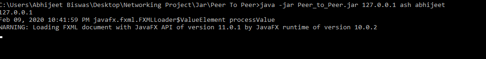
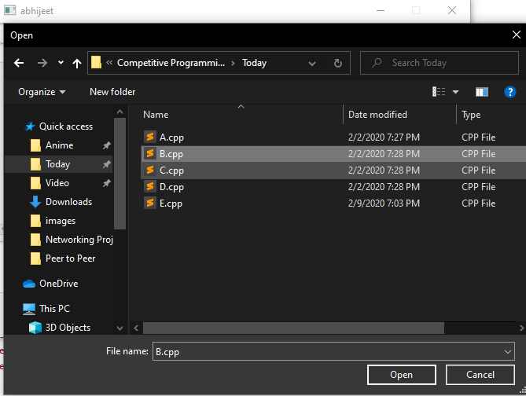
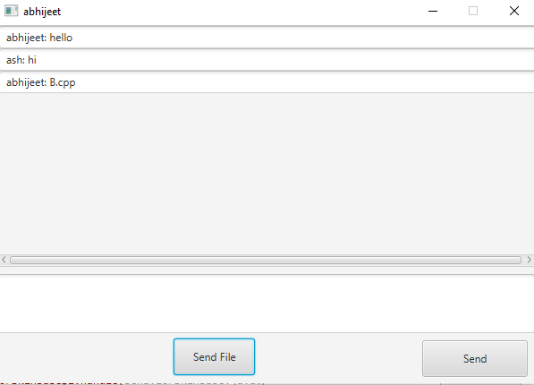

### Group 4 (CSE OVERALL) ->  Group 2 (CSA)
### ABHIJEET BISWAS (Leader)
### Kishlay Kumar   (Slot 2)
### Aman Kumar Gaurav (Slot 3)

####PEER TO PEER
Instructions to use the Jar File: 
`1. Open the Terminal or CMD ` 
`2. Type the command :`  
&nbsp;&nbsp;&nbsp;&nbsp;&nbsp;java -jar Peer_to_Peer.jar ip-address_of_other_client yourname friendname 
&nbsp;&nbsp;&nbsp;&nbsp;&nbsp;Example: 
&nbsp;&nbsp;&nbsp;&nbsp;&nbsp;java -jar Peer_to_Peer.jar 127.0.0.1 abhijeet ash 
`Do step 1 and 2` for both clients 
Now you can send and receive messages and files using the GUI 

**In order to use between Remote Hosts just change the localhost IP with corresponding IPV4 address of Hosts/Server**
