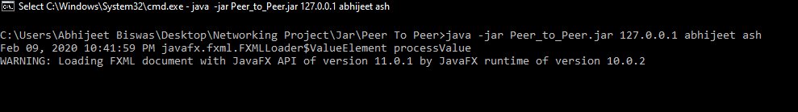
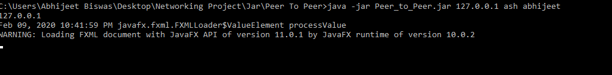
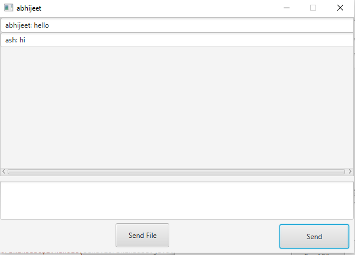
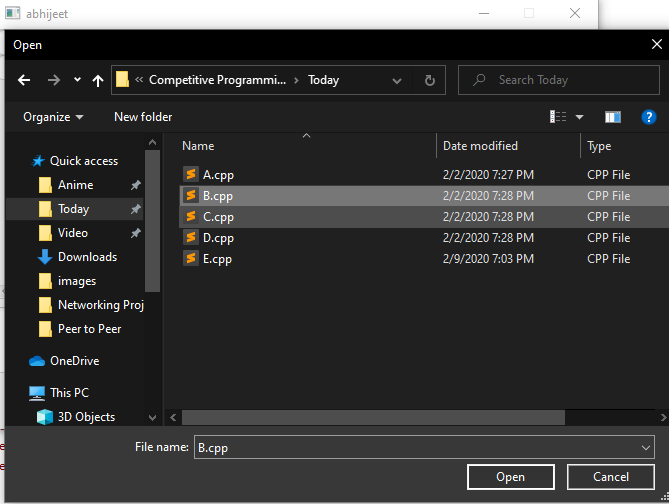
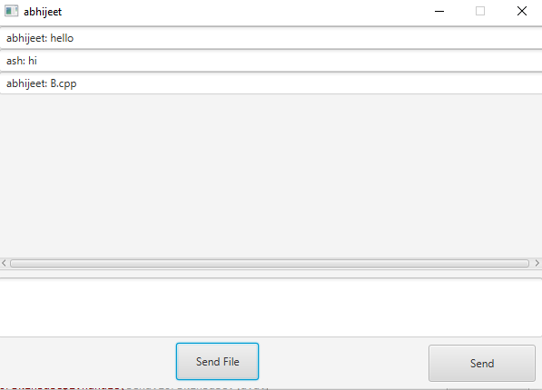
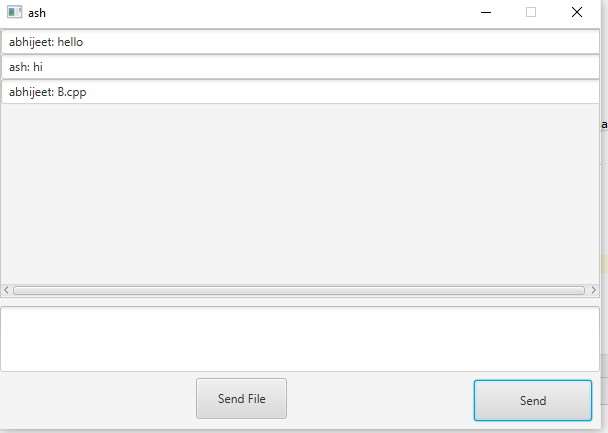

### File Sharing App over the network

This is a JavaFx based project written using Intellij Idea IDE.
The Jar files for both Peer to Peer and, Server Client application are present in the **Jar folder**  along with the required instructions.
The Source codes are present in **Source Code** Folder. 
**Both Server To Client and Peer To Peer applications were thoroughly tested on both localhost as well as Remote Hosts.**

 #### PEER TO PEER
 **Goto ./Jar/Peer To Peer**
 **Instructions to use the Jar File:**  
 `1. Open the Terminal or CMD ` 
 `2. Type the command :`  
 &nbsp;&nbsp;&nbsp;&nbsp;&nbsp;java -jar Peer_to_Peer.jar ip-address_of_other_client yourname friendname 
 &nbsp;&nbsp;&nbsp;&nbsp;&nbsp;Example: 
 &nbsp;&nbsp;&nbsp;&nbsp;&nbsp;java -jar Peer_to_Peer.jar 127.0.0.1 abhijeet ash 
 `Do step 1 and 2` for both clients 
 Now you can send and receive messages and files using the GUI 
 

 

 

 

 

 

 

 
#### Server To client
**Goto the location : ./Jar/Server To Client/**  

**Instructions to use the Jar Files:** 
`First create the server: ` 
`1. Open the Terminal or CMD ` 
`2. Type the command :`  
&nbsp;&nbsp;&nbsp;&nbsp;&nbsp;java -jar Server.jar 

  

`For clients: `  
`1. Open the Terminal or CMD ` 
`2. Type the command :`  
&nbsp;&nbsp;&nbsp;&nbsp;&nbsp;java -jar Client.jar serverIp myname friendname 
&nbsp;&nbsp;&nbsp;&nbsp;&nbsp;Example: 
&nbsp;&nbsp;&nbsp;&nbsp;&nbsp;java -jar Client.jar 127.0.0.1 abhijeet ash 
`Do step 1 and 2` for both clients 

Now you can send and receive messages and files using the GUI 

**In order to use between Remote Hosts just change the localhost IP with corresponding IPV4 address of Hosts/Server**
